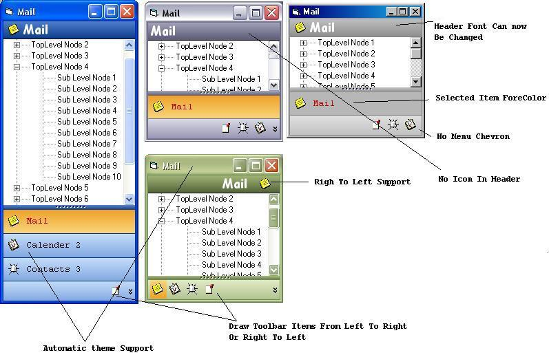



## Outlook 2003 SideBar V1\.6 Final \(Update 25 Aug 2004\)

### Description

A Complete Implementation Of The Outlook 2003 Sidebar Control.

Now Version 1.4

Too Many Updates To Mention Take A Look.

This Code Is Completely Free, But If You Use It Please Credit The Me, Alot Of Time And Effort Has Went Into This Code.

As Always Comments and Constructive Criticism Is Always Welcome.

Kind Regards

Gary

----

Updated: 24 Aug 2004

Fixed: The Large Icon No Draws Properly On The Toolbar.

Added New Propery: Display Chevron Menu.

Gives The Developer Control On Wether Or No The To Show The Popup Menu.

Control Version updated To Version 1.5

Kind Regards

Gary

----

Updated: 25 Aug 2004

This Is The Final Update I Will Be Posting.(Until I Get More Time)

Added: Caption Font Property, Item Selected Color Property.

Changed The Menu Chevron Color Appearance To Look More Like The Outlook 2003 Sidebar Chevron Button.

Cleaned Up The Code And Set Version To 1.6

Kind Regards

Gary
 
### More Info
 

             |
---                |---
**Submitted On**   |2004-08-25 10:22:48
**By**             |[Phantom Man](https://github.com/Planet-Source-Code/PSCIndex/blob/master/ByAuthor/phantom-man.md)
**Level**          |Advanced
**User Rating**    |4.9 (321 globes from 65 users)
**Compatibility**  |VB 6\.0
**Category**       |[Custom Controls/ Forms/  Menus](https://github.com/Planet-Source-Code/PSCIndex/blob/master/ByCategory/custom-controls-forms-menus__1-4.md)
**World**          |[Visual Basic](https://github.com/Planet-Source-Code/PSCIndex/blob/master/ByWorld/visual-basic.md)
**Archive File**   |[Outlook\_201785968252004\.zip](https://github.com/Planet-Source-Code/phantom-man-outlook-2003-sidebar-v1-6-final-update-25-aug-2004__1-55493/archive/master.zip)

